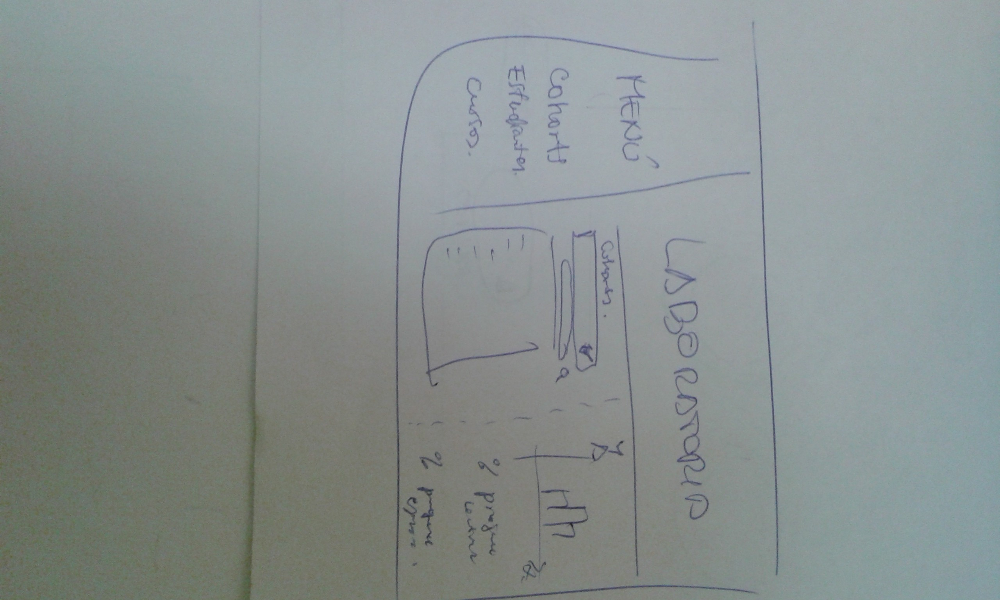
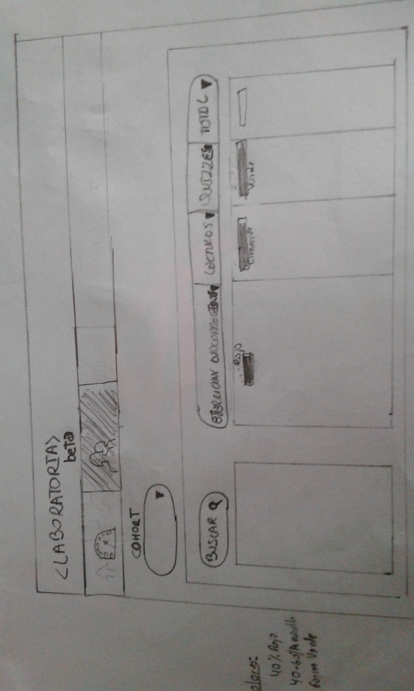
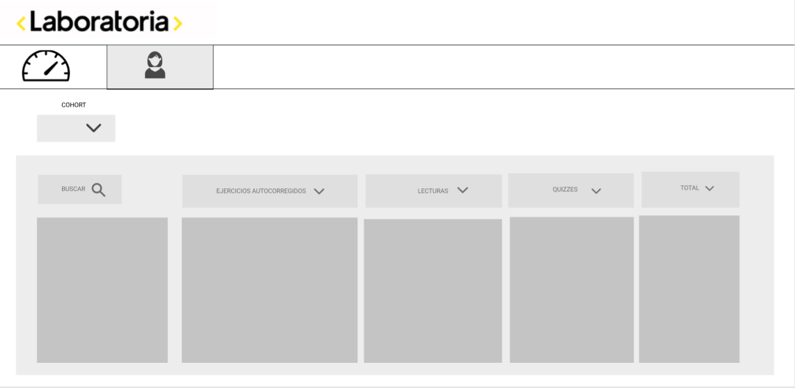

# Data Dashboard (Proyecto 2 CC)

## Colaboradoras

* Maricruz Enrique Rivera
* Yanina Portal Loarte

## Preámbulo

En Laboratoria, las Training Managers (TMs) hacen un gran trabajo al analizar la
mayor cantidad de datos posibles respecto al progreso de las estudiantes para
apoyarlas en su aprendizaje.

La principal medida de progreso de una estudiante en Laboratoria es su avance
completando los proyectos de la [Ruta de Aprendizaje](https://docs.google.com/spreadsheets/d/1AoXQjZnZ5MTPwJPNEGDyvn5vksiOUoPr932TjAldTE4/edit#gid=536983970)
y su desempeño en función a la [Rúbrica de Niveles Esperados](https://docs.google.com/spreadsheets/d/e/2PACX-1vSkQy1waRpQ-16sn7VogiDTy-Fz5e7OSZSYUCiHC_bkLAKYewr4L8pWJ_BG210PeULe-TjLScNQQT_x/pubhtml).
Sin embargo, para completar estos proyectos las estudiantes acceden a contenidos
de aprendizaje (lecturas, videos, ejercicios y quizzes) en un sistema que
llamamos LMS (Learning Management System). El LMS acumula data sobre quién
leyó qué, qué ejercicios se han completado, los resultados de los quizzes, etc.

A pesar de que la data de progreso del LMS (ej. lecturas leídas, ejercicios
  completados, nota en quizzes, etc.) no impacta directamente en la evaluación
  de una estudiante, sí es una pieza de información relevante que las TMs
  quisieran visualizar para tener un mejor entendimiento de cómo va cada
  estudiante en su proceso de aprendizaje.

Así, el reto de este proyecto es crear una interfaz donde las TMs puedan
_ver_ y _usar_ la data de progreso del LMS. Para ello, proponemos crear un
**data dashboard** (_tablero de visualización de datos_).

## Definicion del producto 

## Publico Objetivo

El producto a desarrollar esta orientada a la Trading Manager ya que es la encargada de seguir los avances de aprendizaje (ejercicios, lecturas  y quizees) mediante la recopilación e interpretación de datos complejos representado en graficos .

## Objetivos del usuario con respecto al producto.

Manipular y visualizar la data que estan representados en graficos para su rapida lectura.

## Datos relevantes.

A raiz de la entrevista se pudo concluir los datos que consideraba más relevantes por ello la distribución de los elementos como se puede apreciar en el diseño de Alta Fidelidad.

## Frecuencia de revision de datos.

Los datos son revisados semanalmente por la Trading Manager.

## Resolucion del problema.

Tendra acceso a la data mediante graficos de rapida lectura , obteniendo en primer lugar una vista general  en donde se puede visualizar el  promedio  del cohort que se elija , y en otra pestaña poder obtener con mayor detalle el avance de cada alumna.

## Proceso de Diseño.

El primer boceto que se realizo , que se pensó como posible solución que cubriria los requerimientos pedidos ,es el siguiente.

>Primer boceto.

Al entrevistar a la Trading Manager , nos indico que deberiamos modificar lo siguiente :

* Unir la lista de alumnos y los porcentajes ya que estaban separados , ya que nuestra idea inicial era que ese cuadro desapareciara  al momento de que seleccionara el nombre de una alumna , por lo tanto deberia estar separado ; pero la observición de la Trading Manager era que deberian estar juntos para que pueda relacionar alumna y porcentaje de avance.

* La prioridad de cursos , en primer lugar ejercicios autocorregidos  , seguido lecturas y  por ultimo quizzes.

* Nos indico los gráficos de cada curso en especifico (ejercicios , lecturas y quizzes) en caso de llegar al Hacking Edition , para lecturas grafico circular , para quizzes y ejercicios graficos en barra.

* Poder distinguir segun los colores de fondo el avance en modo general con un color en especifico , por ejemplo : 
Del 0-40% en color rojo , del 40% - 60% color amarillo y del 60% al 100% en color verde.

* Otro elemento que se podria tomar en cuenta seria una nueva pagina en donde pueda tener acceso a un promedio general.

Como resultado de las modificaciones , se presenta el siguiente boceto.

## Prototipo de Alta Fidelidad.

